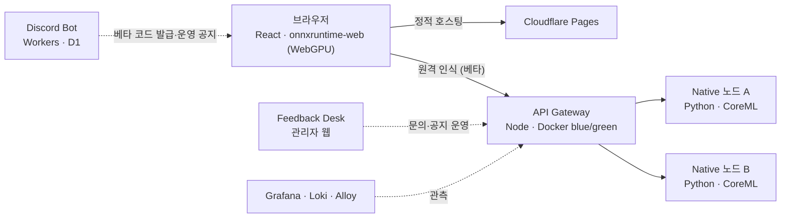

# Maple Timer — 메이플스토리 실시간 알림 도우미

> **https://maple-timer.com**

## 프로젝트 개요

Maple Timer는 메이플스토리 플레이 화면을 **브라우저 안에서 실시간 분석**해
스킬 재설치·룬 출현·버프 종료 같은 순간을 놓치지 않게 알려주는 웹 서비스입니다.

- 사용자가 직접 선택한 **화면 공유 영역만** 분석합니다. 게임 클라이언트,
  메모리, 패킷, 키보드/마우스 입력에는 일절 접근하지 않습니다.
- 모든 감지 모델(YOLO 버프 감지, CNN 룬 감지, 숫자 OCR)은 직접 수집·학습한
  자체 모델이며, 기본 동작은 **온디바이스**(WebGPU/WASM)로 실행됩니다.
- 설치가 필요 없는 웹앱으로, 브라우저 탭 하나로 동작합니다.

## 시연

https://github.com/maple-timer/.github/raw/main/profile/demo.mp4

## 성과

실시간 동시 접속 **1,000명**(최근 30분 기준) — 알림 재생 이벤트 30분당 1.7만 회.

## 구조

## 주요 기능 요약

| 기능 | 설명 |
| --- | --- |
| 스킬 알림 (정밀) | 버프칸을 분석해 솔 야누스·에르다 파운틴 등 설치기 재설치 시점을 감지 |
| 룬 알림 | 미니맵에서 룬 출현을 CNN으로 감지 |
| 사냥 멈춤 알림 | 경험치·쿨타임 변화가 멈추면 알림 |
| 버프 종료 알림 | 유니온의 부·행운, 물약, 경험치 쿠폰 종료 시점 감지 |
| 특수 코어 · 부스터 종료 | 쿨타임/판독 기반 카운트다운 알림 |
| 울티마 스쿼드 알림 | 장비 가방·보스 등장 화면 감지 |
| PiP 타이머 | 게임 위에 항상 떠 있는 소형 타이머 창 |
| 원격 인식 (초대 베타) | 무거운 parser 연산만 전용 서버로 오프로드 — 저사양·CPU 모드 사용자 지원 |

## 시스템 구성 요소

| 저장소 | 역할 |
| --- | --- |
| `maple-timer` | 웹앱 본체 (Cloudflare Pages) |
| `maple-timer-api` | 원격 인식 게이트웨이 · 운영 API (Docker blue/green, 무중단 a/b 롤링) |
| `maple-timer-remote-recognition` | 네이티브 추론 서비스 (CoreML/ONNX, 2노드 좌석 풀) |
| `maple-timer-discord` | 커뮤니티 봇 — 베타 코드 발급, 패치노트 게시, 문의 채널 |
| `maple-feedback-desk-operational-status` | 관리자 웹 — 문의·제보 처리, 운영 공지 편집 |
| `maple-lab-*` | 모델 학습 랩 — 버프 아이콘 추출/매칭, 룬 감지, 쿨다운 OCR |

## 기술 스택

| 영역 | 기술 |
| --- | --- |
| Frontend | React, TypeScript, Vite, onnxruntime-web (WebGPU/WASM), Web Workers |
| Edge | Cloudflare Pages · Functions · Workers · D1 |
| Gateway | Node.js, Docker blue/green, 좌석 기반 동적 노드 배정 |
| Native | Python, ONNX Runtime (CoreML), numba 전처리, launchd a/b 슬롯 |
| ML | YOLOv8n 버프 감지, CenterNet/Cascade 룬 감지, 자체 OCR — 전 모델 자체 학습 |
| Observability | Grafana, Loki, Prometheus, Alloy |
